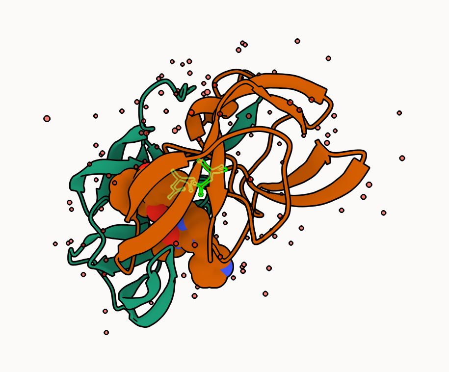

## Introduction to the RCSB Protein Data Bank

The PDB archive is the major repository of information about the 3D structures of large biological molecules, including proteins and nucleic acids.In the first section of this lab we will interact with the main US based PDB website:

```{r}
my_data <- read.csv("pdb_stats (2).csv")
                    
head(my_data)
```

> Q1: What percentage of structures in the PDB are solved by X-Ray and Electron Microscopy.

```{r}
colnames(my_data)
```

```{r}
my_data[, c("X.ray","EM", "Total")]
sum(my_data$X.ray)
sum(my_data$EM)
sum(my_data$Total)
(201582+31970)/249018*100
```

> Q2: What proportion of structures in the PDB are protein?

```{r}
unique(my_data$Molecular.Type)
protein_rows <- my_data$Molecular.Type %in% c(
  "Protein (only)",
  "Protein/Oligosaccharide",
  "Protein/NA"
)

my_data[protein_rows, c("Molecular.Type", "Total")]
```
```{r}
(214078+13981+15759)/249018
```

> Q3: Type HIV in the PDB website search box on the home page and determine how many HIV-1 protease structures are in the current PDB?

There are 1,108 structures in the current PDB.

## Using Molstar

We can use the main [Molstar viewer online](https://molstar.org/viewer/):


> Q. Generate and insert an image of the HIV-Pr cartoon colored by secondary structure, showing the inhibitor (ligand) in ball and stick. 

> Q. Our final image showing catalytic APS 25 and thr all-important active site water 



## Introduction to Bio3D in R

```{r}
library(bio3d)

hiv <- read.pdb("1hsg")

hiv
```
```{r}
head(hiv$atom)
```

```{r}
pdbseq(hiv)
```

Let's try out the new **bio3dview** packagr that is not yet on CRAN. We can use the **remotes** package to install any R package from GitHub. 

## Quick viewing of PDBs

```{r}
library(bio3dview)

sele <- atom.select(hiv, resno=25)

#view.pdb(hiv, backgroundColor = "pink", highlight= sele,highlight.style="spacefill")
```

## Prediction of Protein flexibility

```{r}
adk <- read.pdb("6s36")
m <- nma(adk)
plot(m)
```

Write out our results as a wee trajectory movie:

```{r}
mktrj(m, file="results.pdb")
```

```{r}
#view.nma(m)
```

## Comparative protein structure analysis with PCA

We start with a database id "1ake_A"

```{r}
library(bio3d)

id <- "1ake_A"
aa <- get.seq(id)
```

```{r}
# When running interactively (Console), do BLAST
# When knitting, load the saved result
if (interactive()) {
  blast <- blast.pdb(aa)
} else {
  load("blast_result.rda")
}
```


Have a wee peak:
```{r}
head(blast$hit.tbl)
```

```{r}
hits <- plot(blast)
```

Peak at out "top hits":

```{r}
head(hits$pdb.id)
```

Now we download these "top hits", these will all be ADK structures in the PDB database.

```{r}
files <- get.pdb(hits$pdb.id, path="pdbs", split=TRUE, gzip=TRUE)
```

We need one package from BioConductor. To set this up, we need first, install a package called **"BiocManager"** from CRAN.

Now, we can use the `install()` function from this package like this:
`BiocManager::install("msa")`

```{r}
pdbs <- pdbaln(files, fit=TRUE, exefile="msa")
```

Let's have a wee peak at out structures after "fitting" or superposing:

```{r}
library(bio3dview)
#view.pdbs(pdbs)
```

```{r}
#view.pdbs(pdbs, colorScheme= "residue")
```

We can run functions like `rmsd()`, `rmsf()`, and the best `pca()`

```{r}
pc.xray <- pca(pdbs)
plot(pc.xray)
```

```{r}
plot(pc.xray, 1:2)
```

Finally, let's make a wee movie of the major "motion" or structural difference in the dataset- we call this "trajectory"

```{r}
mktrj(pc.xray, file="results.pdb")
```


