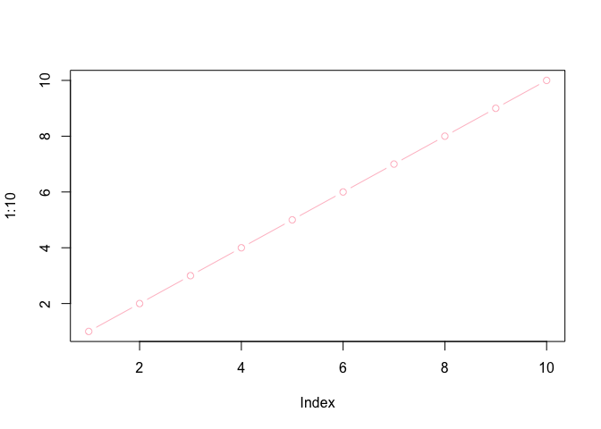

# Class06: R Functions
Angelika (PID: A17475228)

- [Background](#background)
- [A second function](#a-second-function)
- [A new cool function](#a-new-cool-function)

## Background

Functions are at the heart of using R. Everything we do involves calling
and using functions (from data input, analysis to results output).

All functions in R have at least 3 things:

1.  A **name** the thing we use to call the function.
2.  One or more input **arguments** that are comma separated
3.  The **body**, lines of code between curly brackets { } that does the
    work of the function.

\## A first function

Let’s write a silly wee function to add some numbers:

``` r
add <- function(x) {
  x + 1
}
```

Let’s try it out

``` r
add(100)
```

    [1] 101

Will this work

``` r
add(c(100, 200, 300))
```

    [1] 101 201 301

Modify to make it more useful and add more than just 1

``` r
add <- function(x, y=1) {
  x + y
}
```

``` r
add(100, 10)
```

    [1] 110

Will this still work?

``` r
add(100)
```

    [1] 101

``` r
plot(1:10, col= "pink", typ= "b")
```



``` r
log(10, base=10)
```

    [1] 1

> **N.B.** Input aruments can be either **required** or **optional**.
> The later have a fall-back defualt that is specified in the function
> code with an equals sign.

``` r
#add(x=100, y=200, z=300)
```

## A second function

All functions in R look like this

    name <- function(arg) {
      body
    }

The `sample()` function in R …

``` r
sample(1:10, size = 4)
```

    [1] 9 1 5 4

> Q. Return 12 numbers picked randomly from the input 1:10

``` r
sample(1:10, size = 12, replace = TRUE) 
```

     [1]  9 10  4  9  9  8  4  9  4 10  5  2

> Q. Write the code to generate a 12 nucleotide long DNA sequence?

``` r
sample(c("A", "T", "C", "G"), size= 12, replace= TRUE)
```

     [1] "G" "A" "C" "T" "T" "C" "G" "A" "A" "A" "A" "A"

> Q. Write a first version function called `generate_dna()` that
> generates a user specified length `n` random DNA sequence?

    name <- function(arg) { 
      body
    }

``` r
generate_dna <- function(n=6) {
  sample(c("A", "T", "C", "G"), size= n, replace= TRUE)
}
```

``` r
generate_dna(100)
```

      [1] "C" "T" "G" "T" "G" "G" "A" "C" "A" "C" "C" "A" "G" "C" "C" "A" "C" "G"
     [19] "G" "G" "C" "G" "T" "C" "T" "A" "T" "G" "G" "T" "T" "T" "C" "G" "A" "A"
     [37] "C" "G" "A" "G" "G" "T" "A" "C" "G" "A" "G" "G" "A" "A" "A" "A" "A" "T"
     [55] "C" "C" "C" "C" "A" "T" "G" "T" "T" "T" "A" "G" "A" "T" "T" "T" "T" "G"
     [73] "A" "C" "C" "T" "G" "A" "G" "A" "A" "G" "A" "A" "C" "T" "T" "A" "A" "G"
     [91] "T" "T" "A" "C" "T" "G" "G" "C" "T" "G"

> Q. Modify your function to return a FASTA like sequence so rather than
> \[1\] “G”, “C”, “A”, “A”, “T”, we want “GCAAT”

``` r
generate_dna <- function(n=6) {
  bases <- c("A", "C", "G", "T")
  ans <- sample(bases, size=n, replace=TRUE)
  ans <- paste(ans, collapse= "")
  return(ans)
  x <- poopoopants
  x
}
```

``` r
generate_dna(10)
```

    [1] "AAGACTGTCC"

> Q. Give the user an option to return FASTA format output sequence or
> standard multi-element vector format?

``` r
generate_dna <- function(n=6, fasta= TRUE) {
  bases <- c("A", "C", "G", "T")
  ans <- sample(bases, size=n, replace=TRUE)
  
  if (fasta) {
  ans <- paste(ans, collapse= "")
  cat("Hello...")
  } else {
    cat("is it me you are looking for...")
  }
  return(ans)
  
}
```

``` r
generate_dna(10)
```

    Hello...

    [1] "TTGCTCATCT"

``` r
generate_dna(10, fasta= F)
```

    is it me you are looking for...

     [1] "T" "G" "A" "A" "A" "T" "T" "G" "C" "A"

## A new cool function

> Q. Write a function called `generate_protein()` that generates a user
> specified length protein sequence in FASTA like format?

``` r
generate_protein <- function(n, fasta= TRUE) {
  aa <- c("A","R","N","D","C",
          "E","Q","G","H","I",
          "L","K","M","F","P",
          "S","T","W","Y","V")
  ans <- sample(aa, size=n, replace= T)
  
  if (fasta) { 
  ans <-paste(ans, collapse= "")
  }
  return(ans)
}
```

``` r
generate_protein(10)
```

    [1] "ETSVDDGDNC"

``` r
generate_protein(10, fasta= F)
```

     [1] "Y" "L" "A" "R" "A" "Q" "M" "W" "T" "N"

> Q. Use your new `generate_protein()` function to generate all
> sequences between length 6 and 12 amino-acids in length and check if
> any of these are unique in nature (i.e. found in the NR database at
> NCBI)?

``` r
generate_protein(6)
```

    [1] "TDTWEM"

``` r
generate_protein(7)
```

    [1] "YAMHEII"

``` r
generate_protein(8)
```

    [1] "MNKCWWMS"

``` r
generate_protein(9)
```

    [1] "DHLVKMEIQ"

``` r
generate_protein(10)
```

    [1] "KQQSKKNVGL"

``` r
generate_protein(11)
```

    [1] "ETAEKWAEVSI"

``` r
generate_protein(12)
```

    [1] "TLHPAFATFHGT"

Or we could do`for()` loop:

``` r
for(i in 6:12) {
  cat(">", i, sep="", "\n")
  cat (generate_protein(i), "\n")
}
```

    >6
    QNIDDC 
    >7
    WMWLDVC 
    >8
    VNISPKIM 
    >9
    TSFDQAEIS 
    >10
    EMLPEVKADM 
    >11
    HAQTWFVGTEP 
    >12
    TSCYKWSRPYHF 
